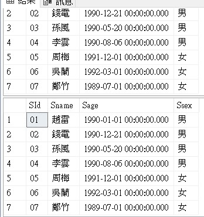
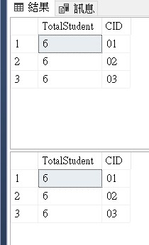

# SQL50Quiz
經典50題SQL練習
[题目来源](https://blog.csdn.net/flycat296/article/details/63681089)

## Table資訊
1.學生表
Student(SId,Sname,Sage,Ssex)
SId 學生編號,Sname 學生姓名,Sage 出生年月,Ssex 學生性別

2.課程表
Course(CId,Cname,TId)
CId 課程編號,Cname 課程名稱,TId 教師編號

3.教師表
Teacher(TId,Tname)
TId 教師編號,Tname教師姓名

4.成績表
SC(SId,CId,score)
SId 學生編號,CId 課程編號,score 分數


## 產生資料SQL
```sql
--學生表 Student
create table Student(SId varchar(10),Sname varchar(10),Sage datetime,Ssex varchar(10));
insert into Student values('01' , '趙雷' , '1990-01-01' ,'男');
insert into Student values('02' , '錢電' , '1990-12-21' ,'男');
insert into Student values('03' , '孫風' , '1990-05-20' ,'男');
insert into Student values('04' , '李雲' , '1990-08-06' ,'男');
insert into Student values('05' , '周梅' , '1991-12-01' ,'女');
insert into Student values('06' , '吳蘭' , '1992-03-01' ,'女');
insert into Student values('07' , '鄭竹' , '1989-07-01' ,'女');
insert into Student values('09' , '張三' , '2017-12-20' ,'女');
insert into Student values('10' , '李四' , '2017-12-25' ,'女');
insert into Student values('11' , '李四' , '2017-12-30' ,'女');
insert into Student values('12' , '趙六' , '2017-01-01' ,'女');
insert into Student values('13' , '孫七' , '2018-01-01' ,'女');

--科目表 Course
create table Course(CId varchar(10),Cname nvarchar(10),TId varchar(10))
insert into Course values('01' , '語文' , '02')
insert into Course values('02' , '數學' , '01')
insert into Course values('03' , '英語' , '03')

--教師表 Teacher
create table Teacher(TId varchar(10),Tname varchar(10))
insert into Teacher values('01' , '張三')
insert into Teacher values('02' , '李四')
insert into Teacher values('03' , '王五')

--成績表 SC
create table SC(SId varchar(10),CId varchar(10),score decimal(18,1))
insert into SC values('01' , '01' , 80)
insert into SC values('01' , '02' , 90)
insert into SC values('01' , '03' , 99)
insert into SC values('02' , '01' , 70)
insert into SC values('02' , '02' , 60)
insert into SC values('02' , '03' , 80)
insert into SC values('03' , '01' , 80)
insert into SC values('03' , '02' , 80)
insert into SC values('03' , '03' , 80)
insert into SC values('04' , '01' , 50)
insert into SC values('04' , '02' , 30)
insert into SC values('04' , '03' , 20)
insert into SC values('05' , '01' , 76)
insert into SC values('05' , '02' , 87)
insert into SC values('06' , '01' , 31)
insert into SC values('06' , '03' , 34)
insert into SC values('07' , '02' , 89)
insert into SC values('07' , '03' , 98)
```

## Quiz
1.	查詢" 01 "課程比" 02 "課程成績高的學生的資訊及課程分數

2.	查詢同時存在" 01 "課程和" 02 "課程的情況

3.	查詢存在" 01 "課程但可能不存在" 02 "課程的情況(不存在時顯示為 null )

4.	查詢不存在" 01 "課程但存在" 02 "課程的情況

5.	查詢平均成績大於等於 60 分的同學的學生編號和學生姓名和平均成績

6.	查詢在 SC 表存在成績的學生資訊

7.	查詢所有同學的學生編號、學生姓名、選課總數、所有課程的總成績(沒成績的顯示為 null )

8.	查有成績的學生資訊

9.	查詢「李」姓老師的數量 

10.	查詢學過「張三」老師授課的同學的資訊 

11.	查詢沒有學全所有課程的同學的資訊 

12.	查詢至少有一門課與學號為" 01 "的同學所學相同的同學的資訊 

13.	查詢和" 01 "號的同學學習的課程完全相同的其他同學的資訊 

14.	查詢沒學過"張三"老師講授的任一門課程的學生姓名 

15.	查詢兩門及其以上不及格課程的同學的學號，姓名及其平均成績 

16.	檢索" 01 "課程分數小於 60，按分數降冪排列的學生資訊

17.	按平均成績從高到低顯示所有學生的所有課程的成績以及平均成績

18.	查詢各科成績最高分、最低分和平均分：

以如下形式顯示：課程 ID，課程 name，最高分，最低分，平均分，及格率，中等率，優良率，優秀率
及格為>=60，中等為：70-80，優良為：80-90，優秀為：>=90
要求輸出課程號和選修人數，查詢結果按人數降冪排列，若人數相同，按課程號昇冪排列

19.	按各科成績進行排序，並顯示排名， Score 重複時保留名次空缺

20.	按各科成績進行排序，並顯示排名， Score 重複時合併名次

21.	查詢學生的總成績，並進行排名，總分重複時保留名次空缺

22.	查詢學生的總成績，並進行排名，總分重複時不保留名次空缺

23.	統計各科成績各分數段人數：課程編號，課程名稱，[100-85]，[85-70]，[70-60]，[60-0] 及所占百分比

24.	查詢各科成績前三名的記錄

25.	查詢每門課程被選修的學生數 

26.	查詢出只選修兩門課程的學生學號和姓名 

27.	查詢男生、女生人數

28.	查詢名字中含有「風」字的學生資訊

29.	查詢同名同性學生名單，並統計同名人數

30.	查詢 1990 年出生的學生名單

31.	查詢每門課程的平均成績，結果按平均成績降冪排列，平均成績相同時，按課程編號昇冪排列

32.	查詢平均成績大於等於 85 的所有學生的學號、姓名和平均成績 

33.	查詢課程名稱為「數學」，且分數低於 60 的學生姓名和分數 

34.	查詢所有學生的課程及分數情況（存在學生沒成績，沒選課的情況）

35.	查詢任何一門課程成績在 70 分以上的姓名、課程名稱和分數

36.	查詢不及格的課程

37.	查詢課程編號為 01 且課程成績在 80 分以上的學生的學號和姓名

38.	求每門課程的學生人數 

39.	成績不重複，查詢選修「張三」老師所授課程的學生中，成績最高的學生資訊及其成績

40. 成績有重複的情況下，查詢選修「張三」老師所授課程的學生中，成績最高的學生資訊及其成績

41.	查詢不同課程成績相同的學生的學生編號、課程編號、學生成績 

42.	查詢每門功成績最好的前兩名

43.	統計每門課程的學生選修人數（超過 5 人的課程才統計）。

44.	檢索至少選修兩門課程的學生學號 

45.	查詢選修了全部課程的學生資訊

46.	查詢各學生的年齡，只按年份來算 

47.	按照出生日期來算，當前月日 < 出生年月的月日則，年齡減一

48.	查詢本周過生日的學生資訊

49.	查詢下周過生日的學生資訊

50.	查詢本月過生日的學生資訊

51.	查詢下月過生日的學生資訊


## My Solution
1.	查詢" 01 "課程比" 02 "課程成績高的學生的資訊及課程分數
>Think：用corss join

```sql
select c.*,d.Cname ,a.score,e.Cname,b.score from 
SC a, SC b, Student c,Course d,Course e
where
1=1
and a.Sid=b.Sid
and a.Cid=01
and b.Cid=02
and a.score>b.score
and c.Sid=a.Sid
and d.Cid=a.Cid
and e.Cid=b.Cid
```


2.	查詢同時存在" 01 "課程和" 02 "課程的情況
>Think：用cross join

```sql
SELECT * FROM SC a, SC b
WHERE
1=1
AND a.Sid=b.Sid
AND a.Cid=01
AND b.Cid=02
```


3.	查詢存在" 01 "課程但可能不存在" 02 "課程的情況(不存在時顯示為 null )
>Think：用兩個Table的子查詢，做Left Join

```sql
Select * from 
(Select * from SC Where CId=01) A
Left Join
(Select * FROM SC WHERE CId=02) B
On A.SId=B.SId
```


4.	查詢不存在" 01 "課程但存在" 02 "課程的情況
>Think：用Left Join

```sql
Select * from
(Select * from sc Where CId=02) a
LEFT JOIN 
(Select * from sc where Cid=01) b
On a.SId=b.SId
Where b.CId is null
```


5.	查詢平均成績大於等於 60 分的同學的學生編號和學生姓名和平均成績
>Think：用Group by

```sql
SELECT A.SId,A.Sname,B.AVGScore FROM Student A
JOIN 
(SELECT sid,AVG(score) AVGScore FROM SC
GROUP BY SId
HAVING AVG(score) >60) B
ON A.SId=B.SId
```


6.	查詢在 SC 表存在成績的學生資訊
>Think：1. GROUP by 2. DISTINCT

```sql
--1
SELECT * FROM Student 
WHERE SId IN 
(
SELECT a.Sid FROM SC a
Join Student b
on a.SId=b.SId
GROUP by a.Sid
)
--2
SELECT DISTINCT a.* FROM Student a
Join SC b
on a.SId=b.SId
```


7.	查詢所有同學的學生編號、學生姓名、選課總數、所有課程的總成績(沒成績的顯示為 null )
>Think：用LEFT JOIN、GROUP BY

```sql
SELECT A.Sid,A.Sname,COUNT(B.CId) ClassAmount,SUM(B.Score) TotalScore 
FROM Student A
Left JOIN SC B
ON A.SId=B.SId
GROUP BY A.SId,A.Sname

```


8.	查有成績的學生資訊
>Think：Join、DISTINCT

```sql
SELECT DISTINCT A.* FROM Student A
Join SC B
ON A.SId=B.SId
```


9.	查詢「李」姓老師的數量 
>Think：用like %

```sql
SELECT COUNT(*)NameCount FROM Teacher
WHERE Tname LIKE ('李%')
```


10.	查詢學過「張三」老師授課的同學的資訊 
>Think：用Join

```sql
SELECT DISTINCT A.* FROM Student A
JOIN SC B
On A.Sid=B.SId
JOIN Course C
On B.CId=C.CId
JOIN Teacher D
On D.TId=C.TId
WHERE D.Tname='張三' 
```


11.	查詢沒有學全所有課程的同學的資訊 
>Think：用Count、Group by、子查詢

```sql
SELECT sc.SId, st.Sname,COUNT(sc.CId) CourseCount FROM SC sc
Join Student st 
On sc.SId =st.SId
GROUP BY sc.SId,st.Sname
HAVING COUNT(sc.Cid)<
(SELECT COUNT(*) FROM Course)
```


12.	查詢至少有一門課與學號為" 01 "的同學所學相同的同學的資訊 
>Think：先查01、再用CID In做子查詢

```sql
SELECT * FROM Student 
WHERE SID IN (
SELECT DISTINCT(SID) FROM SC
WHERE CID IN (
SELECT CID FROM SC
WHERE SID =01
)
AND SID <> 01
)
```


13.	查詢和" 01 "號的同學學習的課程完全相同的其他同學的資訊 
>Think：用join後，再用Count計算數量是否相同

```sql
--參考網路
select stu.* ,r.t2_count from 
student as stu,
(select distinct t2.sid as t2_sid ,count(t2.cid) as t2_count 
	        from(select sc.sid ,sc.cid from sc where sc.sid = 01) t1
		inner join 
			(select sc.sid ,sc.cid from sc ) t2
		on t1.cid = t2.cid
		group by t2.sid
	) as r
	where 
		r.t2_count = (select count(sc.cid) from sc where sc.sid = 05)
		and stu.sid = r.t2_sid;
--可能會有漏洞，如果課程不同但數量相同，在r.t2_count = (select count(sc.cid) from sc where sc.sid = 05)的判斷就會錯誤，畢竟不是從同一張表來

--關鍵:
SELECT B.* FROM 
(SELECT CID FROM SC WHERE SID=01) AS A
JOIN SC AS B
ON A.CId=B.CId

--MySQL:用TEMP TABLE
DECLARE @stSid int
SET @stSid=01

SELECT * INTO #TEMP FROM
(SELECT B.SId, COUNT(B.CID) AS CIDCOUNT FROM 
(SELECT CID FROM SC WHERE SID=@stSid) AS A
JOIN SC AS B
ON A.CId=B.CId
GROUP BY B.SID) C

SELECT ST.* FROM Student ST
JOIN #TEMP B
ON ST.SId=B.SId
WHERE B.SId<>@stSid
AND B.CIDCOUNT=
(SELECT CIDCOUNT FROM #TEMP
WHERE SID=@stSid)

DROP TABLE #TEMP

```


14.	查詢沒學過"張三"老師講授的任一門課程的學生姓名 
>Think：先找出有上過張三的學生，再排除

```sql
SELECT * FROM Student
WHERE SID NOT IN(
SELECT st.SID FROM Student st 
JOIN SC sc 
ON st.SId=sc.SId
WHERE sc.CId IN 
(SELECT CID FROM Course A
JOIN Teacher B
ON A.TId=B.TId
WHERE B.Tname='張三'
)
)
```


15.	查詢兩門及其以上不及格課程的同學的學號，姓名及其平均成績 
>Think：先找不及格，再group by 數量

```sql
SELECT * FROM Student WHERE 
SId IN (
SELECT SID FROM SC
WHERE score<60
GROUP BY SID
HAVING COUNT(SID)>=2
)
```


16.	檢索" 01 "課程分數小於 60，按分數降冪排列的學生資訊
>Think：用Join，注意用IN會錯誤

```sql
--正確
SELECT * FROM Student st
JOIN (
SELECT SID,score FROM SC
WHERE CID=01
AND score<60
) sc
ON st.SId=sc.SId
ORDER BY sc.score DESC

--錯誤
SELECT * FROM Student 
WHERE SID IN (
SELECT SID FROM SC
WHERE CID=01
AND score<60
ORDER BY score DESC
)
```


17.	按平均成績從高到低顯示所有學生的所有課程的成績以及平均成績
>Think：先整理AVG，再JOIN到課程

```sql
SELECT sc.*, avgsc.avgscore FROM SC sc
JOIN(
SELECT SID,AVG(score) avgscore FROM SC
GROUP BY SID
) avgsc
ON sc.SId=avgsc.SId
```


18.	查詢各科成績最高分、最低分和平均分：

以如下形式顯示：課程 ID，課程 name，最高分，最低分，平均分，及格率，中等率，優良率，優秀率
及格為>=60，中等為：70-80，優良為：80-90，優秀為：>=90
要求輸出課程號和選修人數，查詢結果按人數降冪排列，若人數相同，按課程號昇冪排列
>Think：
>>1. 先處理各科最高、最低、平均分
>>2. 建立級距表、顯示級距結果
>>3. 統計級距數量(不可使用Count，要用SUM)
>>4. 各級距比率，除法轉型
>>5. 計算結果組合


```sql
--先處理各科最高、最低、平均分
SELECT CID,MAX(score) Maxsc,MIN(score)Minsc,AVG(score) Avgsc,COUNT(CID) Students FROM SC
GROUP BY CID

--建立級距表、顯示級距結果
SELECT *,
(
CASE
WHEN score BETWEEN 60 AND 69
THEN '及格'
WHEN score BETWEEN 70 AND 79
THEN '中等'
WHEN score BETWEEN 80 AND 89
THEN '優良'
WHEN score >=90
THEN '優秀'
ELSE '不及格'
END
) ScoreRange
FROM SC

--統計級距數量(不可使用Count，要用SUM)
--錯誤COUNT，會計算成總數量，不會算各別數量
SELECT A.CID,COUNT('及格') 及格人數,COUNT('中等') 中等人數,COUNT('優良') 優良人數,
COUNT('優秀') 優秀人數,COUNT('不及格') 不及格人數,COUNT(A.CID) 總修課人數 FROM (
SELECT *,
(
CASE
WHEN score BETWEEN 60 AND 69
THEN '及格'
WHEN score BETWEEN 70 AND 79
THEN '中等'
WHEN score BETWEEN 80 AND 89
THEN '優良'
WHEN score >=90
THEN '優秀'
ELSE '不及格'
END
) ScoreRange
FROM SC
) A
GROUP BY A.CID

--正確SUM，用WHEN THEN加總
SELECT A.CID,
SUM(Case WHEN A.ScoreRange='及格' THEN 1 ELSE 0 END) 及格人數,
SUM(Case WHEN A.ScoreRange='中等' THEN 1 ELSE 0 END) 中等人數,
SUM(Case WHEN A.ScoreRange='優良' THEN 1 ELSE 0 END) 優良人數,
SUM(Case WHEN A.ScoreRange='優秀' THEN 1 ELSE 0 END) 優秀人數,
SUM(Case WHEN A.ScoreRange='不及格' THEN 1 ELSE 0 END) 不及格人數,
COUNT(A.CID) 總修課人數
FROM (
SELECT *,
(
CASE
WHEN score BETWEEN 60 AND 69
THEN '及格'
WHEN score BETWEEN 70 AND 79
THEN '中等'
WHEN score BETWEEN 80 AND 89
THEN '優良'
WHEN score >=90
THEN '優秀'
ELSE '不及格'
END
) ScoreRange
FROM SC
) A
GROUP BY A.CID

--各級距比率，除法轉型
----除法，2*1.0的原因在將2轉成float才會顯示結果，
----2為int，結果為int，結果為0
select 2/6
----2.0為float，結果為float，結果為0.3333
select 2*1.0/6

--各級距比率
SELECT B.CId,
B.及格人數,
CONVERT(varchar,(CONVERT(decimal(5,2),(B.及格人數*1.0/B.總修課人數)*100)))+'%' AS 及格率,
B.中等人數,
CONVERT(varchar,(CONVERT(decimal(5,2),(B.中等人數*1.0/B.總修課人數)*100)))+'%' AS 中等率,
B.優良人數,
CONVERT(varchar,(CONVERT(decimal(5,2),(B.優良人數*1.0/B.總修課人數)*100)))+'%' AS 優良率,
B.優秀人數,
CONVERT(varchar,(CONVERT(decimal(5,2),(B.優秀人數*1.0/B.總修課人數)*100)))+'%' AS 優秀率,
B.不及格人數,
CONVERT(varchar,(CONVERT(decimal(5,2),(B.不及格人數*1.0/B.總修課人數)*100)))+'%' AS 不及格率,
B.總修課人數
FROM(
SELECT A.CID,
SUM(Case WHEN A.ScoreRange='及格' THEN 1 ELSE 0 END) 及格人數,
SUM(Case WHEN A.ScoreRange='中等' THEN 1 ELSE 0 END) 中等人數,
SUM(Case WHEN A.ScoreRange='優良' THEN 1 ELSE 0 END) 優良人數,
SUM(Case WHEN A.ScoreRange='優秀' THEN 1 ELSE 0 END) 優秀人數,
SUM(Case WHEN A.ScoreRange='不及格' THEN 1 ELSE 0 END) 不及格人數,
COUNT(A.CID) 總修課人數
FROM (
SELECT *,
(
CASE
WHEN score BETWEEN 60 AND 69
THEN '及格'
WHEN score BETWEEN 70 AND 79
THEN '中等'
WHEN score BETWEEN 80 AND 89
THEN '優良'
WHEN score >=90
THEN '優秀'
ELSE '不及格'
END
) ScoreRange
FROM SC
) A
GROUP BY A.CID)
B

--計算結果組合 最後SQL
SELECT Scinfo.CId,cs.Cname,ScRange.* FROM 
(SELECT CID,MAX(score) Maxsc,MIN(score)Minsc,AVG(score) Avgsc,COUNT(CID) Students FROM SC
GROUP BY CID) Scinfo
JOIN
(SELECT B.CId,
B.及格人數,
CONVERT(varchar,(CONVERT(decimal(5,2),(B.及格人數*1.0/B.總修課人數)*100)))+'%' AS 及格率,
B.中等人數,
CONVERT(varchar,(CONVERT(decimal(5,2),(B.中等人數*1.0/B.總修課人數)*100)))+'%' AS 中等率,
B.優良人數,
CONVERT(varchar,(CONVERT(decimal(5,2),(B.優良人數*1.0/B.總修課人數)*100)))+'%' AS 優良率,
B.優秀人數,
CONVERT(varchar,(CONVERT(decimal(5,2),(B.優秀人數*1.0/B.總修課人數)*100)))+'%' AS 優秀率,
B.不及格人數,
CONVERT(varchar,(CONVERT(decimal(5,2),(B.不及格人數*1.0/B.總修課人數)*100)))+'%' AS 不及格率,
B.總修課人數
FROM(
SELECT A.CID,
SUM(Case WHEN A.ScoreRange='及格' THEN 1 ELSE 0 END) 及格人數,
SUM(Case WHEN A.ScoreRange='中等' THEN 1 ELSE 0 END) 中等人數,
SUM(Case WHEN A.ScoreRange='優良' THEN 1 ELSE 0 END) 優良人數,
SUM(Case WHEN A.ScoreRange='優秀' THEN 1 ELSE 0 END) 優秀人數,
SUM(Case WHEN A.ScoreRange='不及格' THEN 1 ELSE 0 END) 不及格人數,
COUNT(A.CID) 總修課人數
FROM (
SELECT *,
(
CASE
WHEN score BETWEEN 60 AND 69
THEN '及格'
WHEN score BETWEEN 70 AND 79
THEN '中等'
WHEN score BETWEEN 80 AND 89
THEN '優良'
WHEN score >=90
THEN '優秀'
ELSE '不及格'
END
) ScoreRange
FROM SC
) A
GROUP BY A.CID)
B) ScRange
ON Scinfo.CId=ScRange.CId

JOIN Course cs
ON Scinfo.CId=cs.CId
ORDER BY 
ScRange.總修課人數 Desc,
Scinfo.CId Asc

```


19.	按各科成績進行排序，並顯示排名， Score 重複時保留名次空缺
>Think：用Rank() OVER (PARTITION BY CID ORDER BY Score Desc)
補充資料：<a href="#overpartition"> OVER、RATRITION的用法</a>

```sql
SELECT 
RANK() OVER (PARTITION BY CID ORDER BY score desc) Th
,[SId]
,[CId]
,[score]
FROM [dbo].[SC]
ORDER BY CID,score desc
```


20.	按各科成績進行排序，並顯示排名， Score 重複時合併名次
>Think：用DENSE_RANK() OVER(PARTITION BY CID ORDER BY Score Desc)
可進行不跳號排序

```sql
SELECT 
DENSE_RANK() OVER (PARTITION BY CID ORDER BY score desc) Th,
*
FROM sc
ORDER BY CID,score desc
```


21.	查詢學生的總成績，並進行排名，總分重複時保留名次空缺
>Think：1.各學生總成績(GROUP BY SID)、2.用RANK()，依成績排名跳號

```sql
SELECT RANK() OVER (ORDER BY SUM(score) DESC) TH,SID,SUM(score) Totalscore
FROM sc
GROUP BY SID
```


22.	查詢學生的總成績，並進行排名，總分重複時不保留名次空缺
>Think：用DENSE_RANK()，依成績不跳號

```sql
SELECT DENSE_RANK() OVER(
ORDER BY SUM(score) DESC) Th,
SID,SUM(score) Totalscore
FROM sc
GROUP BY sid
```


23.	統計各科成績各分數段人數：課程編號，課程名稱，[100-85]，[85-70]，[70-60]，[60-0] 及所占百分比
>Think：1. 用CASE WHEN 計算百分比人數 2.GROUP BY 分類各科

```sql
SELECT C.Cname, B.CID,
R100_85,CONVERT(decimal(5,2),R100_85*1.0/Total) R100_85percent,
R85_70,CONVERT(decimal(5,2),R85_70*1.0/Total) R85_70percent,
R70_60,CONVERT(decimal(5,2),R70_60*1.0/Total) R70_60percent,
R60_0,CONVERT(decimal(5,2),R60_0*1.0/Total) R60_percent,
Total
FROM
(
SELECT CID,
SUM(CASE WHEN score>=85  AND score <=100 THEN 1 ELSE 0 END) R100_85,
SUM(CASE WHEN score>=70  AND score <85 THEN 1 ELSE 0 END) R85_70,
SUM(CASE WHEN score>=60  AND score <70 THEN 1 ELSE 0 END) R70_60,
SUM(CASE WHEN score <60 THEN 1 ELSE 0 END) R60_0,
COUNT(*) Total
FROM sc
GROUP BY CID
)B
JOIN 
COURSE C
on B.CId=C.CId
```


24.	查詢各科成績前三名的記錄
>Think：1.各科，考慮用GROUP BY或PARTITION BY 2.同分要怎麼處理

```sql
--錯誤：sid沒有GROUP BY，且同分狀況沒有考慮到
SELECT TOP 3 *
FROM sc
GROUP BY CID
ORDER BY score DESC

--正確：改用RANK判斷名次，可協助處理同分狀況
SELECT * FROM
(
SELECT 
RANK() OVER (PARTITION BY CID ORDER BY SCORE DESC) TH,
*
FROM sc
) A
WHERE A.TH BETWEEN 1 AND 3
```


25.	查詢每門課程被選修的學生數 
>Think：用GROUP BY 或COUNT OVER，用COUNT(*)

```sql
--GROUP BY
SELECT COUNT(*) TotalStudent,CID FROM SC
GROUP BY CID
-- COUNT OVER 注意重複
SELECT DISTINCT COUNT(*) OVER(PARTITION BY CID) TotalStudent,CID
FROM sc
```


26.	查詢出只選修兩門課程的學生學號和姓名 
>Think：用GROUP BY

```sql
SELECT st.* FROM Student st
JOIN (
SELECT SID FROM SC
GROUP BY SID 
HAVING COUNT(*)=2
) B
ON st.SId=B.SId
```


27.	查詢男生、女生人數
>Think：用CASE WHEN SUM 或用 GROUP BY Ssex 

```sql
--CASE WHEN SUM
SELECT 
SUM(CASE WHEN Ssex='男' THEN 1 ELSE 0 END) 男,
SUM(CASE WHEN Ssex='女' THEN 1 ELSE 0 END) 女
FROM Student

--GROUP BY Ssex 
SELECT 
Ssex,COUNT(*) GenderCount
FROM Student
GROUP BY Ssex
```


28.	查詢名字中含有「風」字的學生資訊
>Think：用LIKE % 模糊搜尋

```sql
SELECT * FROM Student 
WHERE Sname LIKE '%風%'
```


29.	查詢同名同性學生名單，並統計同名人數
>Think：看到同名同性，相同表單比較，用CROSS JOIN

```sql
SELECT * FROM Student A,Student B
WHERE 1=1
AND SUBSTRING(A.Sname,1,1)=SUBSTRING(B.Sname,1,1)
AND A.Ssex=B.Ssex
AND A.SId<>B.SId
```


30.	查詢 1990 年出生的學生名單
>Think：用YEAR()

```sql
SELECT * FROM Student
WHERE 
YEAR(Sage)=1990
```


31.	查詢每門課程的平均成績，結果按平均成績降冪排列，平均成績相同時，按課程編號昇冪排列
>Think：用GROUP BY

```sql
SELECT CID,AVG(score) AVGSC
FROM SC
GROUP BY CID
ORDER BY AVG(score) DESC,CID
```


32.	查詢平均成績大於等於 85 的所有學生的學號、姓名和平均成績 
>Think：用GROUP BY

```sql
SELECT st.*, B.AVGSC FROM Student st
JOIN
(
SELECT SID,AVG(score) AVGSC
FROM SC
GROUP BY SID
HAVING AVG(score) >=85
)B
ON st.SId=B.SId

```


33.	查詢課程名稱為「數學」，且分數低於 60 的學生姓名和分數 
>Think：用JOIN

```sql
SELECT st.Sname,sc.score FROM Student st
JOIN SC sc
ON st.SId=sc.SId
JOIN Course cu
ON cu.CId=sc.CId
WHERE 
1=1
AND sc.score<60
AND cu.Cname='數學'
```


34.	查詢所有學生的課程及分數情況（存在學生沒成績，沒選課的情況）
>Think：用Student(大表) LEFT JOIN sc(小表)

```sql
SELECT * FROM Student st
LEFT JOIN SC sc
ON st.SId=sc.SId
```


35.	查詢任何一門課程成績在 70 分以上的姓名、課程名稱和分數
>Think：用JOIN

```sql
SELECT DISTINCT st.Sname,cu.CName,sc.score FROM SC sc
JOIN Student st
ON sc.SId=st.SId
JOIN Course cu
ON cu.CId=sc.CId
WHERE 
1=1
AND sc.score>70
```


36.	查詢不及格的課程
>Think：用JOIN


```sql
SELECT DISTINCT st.Sname,cu.CName,sc.score FROM SC sc
JOIN Student st
ON sc.SId=st.SId
JOIN Course cu
ON cu.CId=sc.CId
WHERE 
1=1
AND sc.score<60
```


37.	查詢課程編號為 01 且課程成績在 80 分以上的學生的學號和姓名
>Think：用JOIN


```sql
SELECT DISTINCT st.SId, st.Sname,cu.CName,sc.score FROM SC sc
JOIN Student st
ON sc.SId=st.SId
JOIN Course cu
ON cu.CId=sc.CId
WHERE 
1=1
AND sc.score>=80
AND sc.CId=01
```


38.	求每門課程的學生人數 
>Think：用GROUP BY

```sql
SELECT CID, COUNT(*) CuCount
FROM SC
GROUP BY CID
```


39.	成績不重複，查詢選修「張三」老師所授課程的學生中，成績最高的學生資訊及其成績
>Think：成績最高，成績不重複(不跳號)用DENSE_RANK() JOIN 他表

```sql
SELECT st.*,B.score FROM Student st
JOIN
(
SELECT 
DENSE_RANK() OVER(PARTITION BY CID ORDER BY score DESC) TH,
SID,CID,score FROM sc
)B
ON B.SId=st.SId
JOIN Course cu
ON cu.CId=B.CId
JOIN Teacher ta
ON ta.TId=cu.TId
WHERE 1=1
AND ta.Tname='張三'
AND B.TH=1
```


40.  成績有重複的情況下，查詢選修「張三」老師所授課程的學生中，成績最高的學生資訊及其成績
>Think：成績最高，成績重複(跳號)用RANK() JOIN 他表

```sql
SELECT st.*,B.score FROM Student st
JOIN
(
SELECT 
RANK() OVER(PARTITION BY CID ORDER BY score DESC) TH,
SID,CID,score FROM sc
)B
ON B.SId=st.SId
JOIN Course cu
ON cu.CId=B.CId
JOIN Teacher ta
ON ta.TId=cu.TId
WHERE 1=1
AND ta.Tname='張三'
AND B.TH=1
```

41.	查詢不同課程成績相同的學生的學生編號、課程編號、學生成績 
>Think：不同課程、成績相同，同表比較用CROSS JOIN

```sql
SELECT * FROM SC A,SC B
WHERE 1=1
AND A.score=B.score
AND A.CId<>B.CId
AND A.SId<>B.SId
```

42.	查詢每門功成績最好的前兩名
>Think：用RANK找各科前兩名

```sql
SELECT st.*,cu.Cname,B.score FROM Student st
JOIN 
(
SELECT 
SID,
RANK() OVER(PARTITION BY CID ORDER BY score DESC) TH,
CID,
score
FROM SC
) B
ON B.SId=st.SId
JOIN Course cu
ON cu.CId=B.CId
WHERE 1=1
AND B.TH <3
ORDER BY cu.CId, B.TH
```

43.	統計每門課程的學生選修人數（超過 5 人的課程才統計）。
>Think：用GROUP BY

```sql
SELECT CID,COUNT(*) AS Students FROM SC
GROUP BY CID
HAVING COUNT(*) >5
```

44.	檢索至少選修兩門課程的學生學號 
>Think：用GROUP BY

```sql
SELECT SID,COUNT(*) Courses FROM SC
GROUP BY SID
HAVING COUNT(*)>=2
```

45.	查詢選修了全部課程的學生資訊
>Think：1.先GROUP BY SID 計算學生選課數 2. 再計算全部課程數 3.兩者相等(全部課程)

```sql
SELECT SID FROM SC
GROUP BY SID 
HAVING COUNT(*)=(
SELECT COUNT(*) FROM Course
)
```

46.	查詢各學生的年齡，只按年份來算 
>Think：

```sql

```

47.	按照出生日期來算，當前月日 < 出生年月的月日則，年齡減一
>Think：

```sql

```

48.	查詢本周過生日的學生資訊
>Think：

```sql

```

49.	查詢下周過生日的學生資訊
>Think：

```sql

```

50.	查詢本月過生日的學生資訊
>Think：

```sql

```

51.	查詢下月過生日的學生資訊
>Think：

```sql

```


## 補充
<div id='overpartition'>
<h2>OVER、RATRITION的用法</h2>

用法案例：
```sql
SELECT 
RANK() OVER (PARTITION BY CID ORDER BY score desc) Th
,[SId]
      ,[CId]
      ,[score]
  FROM [dbo].[SC]
ORDER BY CID,score desc
```
參考資料：https://blog.csdn.net/WuLex/article/details/115037696
參考資料：https://learn.microsoft.com/zh-tw/sql/t-sql/queries/select-over-clause-transact-sql?view=sql-server-ver16
說明：
1.	OVER 稱為視窗函數，OVER子句會先定義查詢結果的分類、排序方式，功能類似GROUP BY
2.	OVER  vs  GROUP BY，OVER 會將搜尋結果全部顯示，GROUP BY 則是不重複顯示(匯集、只顯示一筆)
比較圖：

OVER用法：
放在SUM、AVG、COUNT後面
1.	不加子句：類似GROUP BY，計算全部並顯示整個結果
2.	PARTITION BY：分類
3.	ORDER BY：排序
4.	ROWS、RANGE：ROWS範圍

案例：
```sql
SELECT 
SUM(score) OVER() OVER_ALL,
SUM(score) OVER(PARTITION BY CID) OVER_PARTITION,
SUM(score) OVER(ORDER BY CID) OVER_ORDER,
CID,
score,
sid
FROM sc 
ORDER BY CID
```

說明：
OVER_ALL：全部總和
OVER_PARTITION：依CID分組總和
OVER_ORDER：依CID排序總和(相同排序會直接加總)

補充：
* 也可與GROUP BY結合，這樣計算就是以GROUP BY的資料為主
```sql
SELECT 
SUM(score) OVER(order by cid) OVER_ALL,
score,
cid
FROM SC
GROUP BY score,cid
```


* OVER不可用在MYSQL

</div>